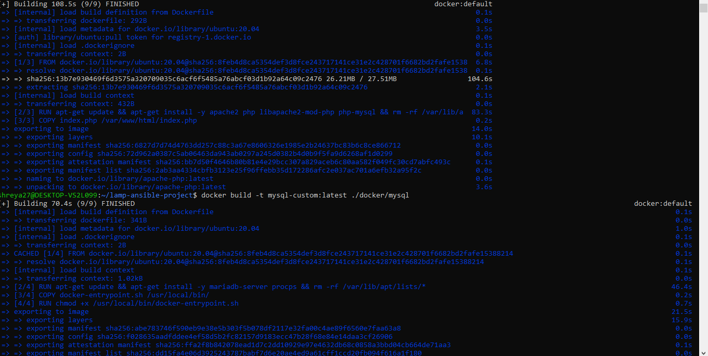
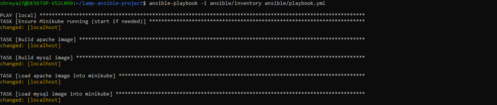
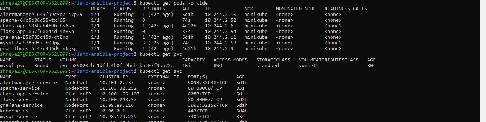
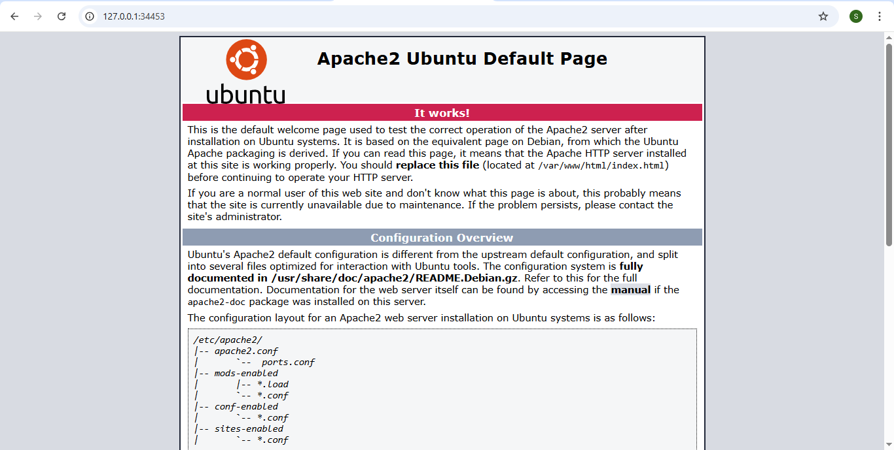

# LAMP Stack Deployment with Ansible & Kubernetes

This project demonstrates automated deployment of a LAMP stack — Apache (with PHP), MySQL, and Linux environment — using Ansible and Kubernetes manifests. It includes containerized services, persistent storage, and service exposure for a full-stack web app setup.

---

## Folder Structure
'''

lamp-ansible-project/
│
├── ansible/                  
│   ├── playbook.yml
│   ├── inventory.ini
│   └── roles/                
│
├── docker/                   
│   ├── Dockerfile-apache-php
│   └── Dockerfile-mysql
│
└── k8s/                      
    ├── apache-deployment.yaml
    ├── mysql-deployment.yaml
    ├── mysql-pvc.yaml
    ├── pvc.json
    └── services.yaml
'''
---

## Project Overview

### Apache Deployment
- Runs an Apache web server with PHP (`apache-php:latest` image).
- Configured with environment variables to connect with MySQL database.
- Exposes port 80 via Kubernetes NodePort service.

### MySQL Deployment
- Runs MySQL database server (`mysql-custom:latest` image).
- Uses Persistent Volume Claim for data persistence.
- Securely configured with environment variables for root password, user, and database.
- Exposes port 3306 via Kubernetes ClusterIP service.

---

## Technologies Used

- **Linux** (base OS, assumed in Kubernetes nodes)
- **Apache** with PHP (containerized)
- **MySQL** (containerized with persistent storage)
- **Ansible** (for automation and configuration management)
- **Kubernetes** (for container orchestration and deployment)
- **Docker** (for container image creation)

---

## Deployment Steps

1. Build custom Docker images for Apache-PHP and MySQL (found in `/docker` folder).
2. Apply Kubernetes manifests in the following order:
    - PersistentVolumeClaim (`mysql-pvc.yaml`)
    - MySQL Deployment and Service (`mysql-deployment.yaml`, `services.yaml`)
    - Apache Deployment and Service (`apache-deployment.yaml`, `services.yaml`)
3. Use Ansible playbooks to automate infrastructure setup and deployment (in `/ansible` folder).

---

## Screenshots and Description

| Step                  | Screenshot                | Description                                         |
|-----------------------|---------------------------|-----------------------------------------------------|
| Docker Images Build   |        | Shows building of Apache-PHP and MySQL Docker images. |
| Ansible Playbook Run  |    | Demonstrates running Ansible playbooks to configure servers. |
| Kubernetes Deployments|     | Displays Kubernetes deployments of Apache and MySQL pods. |
| Services Exposed      |    | Shows services exposing Apache and MySQL outside cluster. |

---

## What I Learned

- How to containerize Apache with PHP and MySQL for a LAMP stack.
- Managing persistent data with Kubernetes PersistentVolumeClaims.
- Writing Kubernetes manifests for deployments and services.
- Using Ansible to automate infrastructure and deployment tasks.
- Integrating Docker, Kubernetes, and Ansible for DevOps workflows.

---

If you want help writing Dockerfiles or Ansible playbook examples, just ask!

